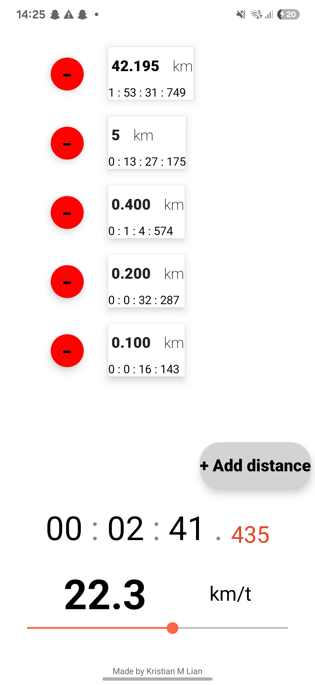
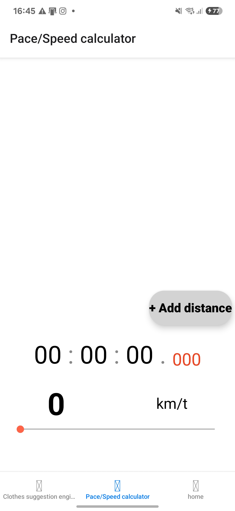
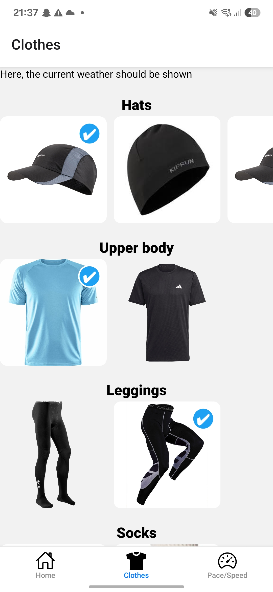
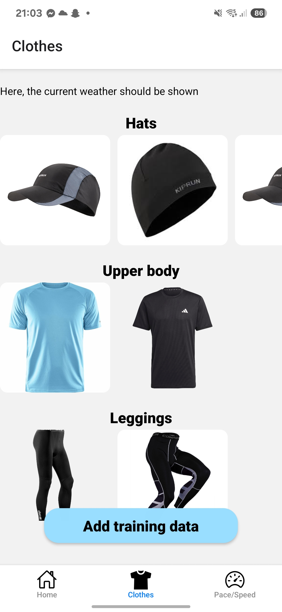
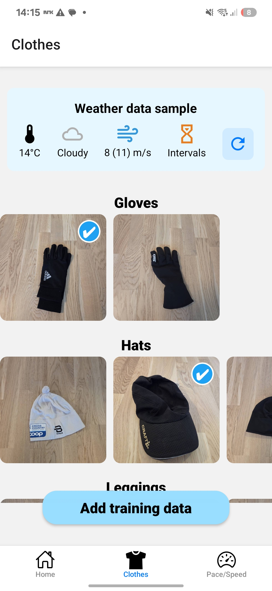

## Screenshots of the app
### Pace/Speed calculator
The pace/speed calculator looks like this currently. 

Super ugly UI, the UX has been the primary focus. Here are some screenshots of the pace/speed calculator as of 15th of June 2025. Subject to change in the future :D
<!-- -->

## Clothes chooser
A bit more friendly UI this time around, as well as UX. Here are some screenshots of the product as of 17th/18th/22nd of June 2025. Subject to change in the future :D
<!-- -->

### About the project
This is a hobby project meant to acquire knowledge in React Native, and app development

